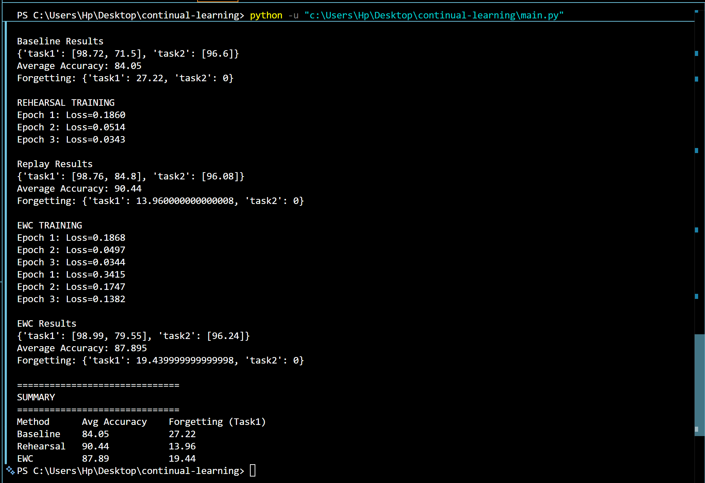

# Continual Learning CNN: Mitigating Catastrophic Forgetting

A PyTorch implementation comparing strategies to mitigate catastrophic forgetting in Convolutional Neural Networks (CNNs) across sequential tasks.

## Overview
When trained sequentially on multiple tasks without safeguards, neural networks experience **catastrophic forgetting**—overwriting previous knowledge while learning new data. This project benchmarks three training strategies:

1. **Baseline**: Naive sequential training (Control Group).
2. **Rehearsal (Experience Replay)**: Data-based strategy using a memory buffer of past task samples.
3. **Elastic Weight Consolidation (EWC)**: Regularization-based strategy penalizing updates to weights critical for past tasks using Fisher Information.

---

## Benchmark Setup

* **Model Architecture**: Simple CNN (2 Conv2D layers + ReLU + MaxPool $\rightarrow$ 2 Linear layers).
* **Dataset & Tasks**:
  * **Task 1**: Standard MNIST digit classification.
  * **Task 2**: Permuted MNIST (pixels shuffled via a fixed random permutation).

---

## Experimental Results

### Key Performance Metrics

| Method | Task 1 Initial Acc | Task 1 Final Acc | Task 2 Acc | **Average Acc** ↑ | **Task 1 Forgetting** ↓ |
| :--- | :---: | :---: | :---: | :---: | :---: |
| **Baseline** | 98.72% | 71.50% | 96.60% | **84.05%** | **27.22%** |
| **EWC** | 98.99% | 79.55% | 96.24% | **87.90%** | **19.44%** |
| **Rehearsal** | 98.76% | 84.80% | 96.08% | **90.44%** | **13.96%** |

* **Average Accuracy**: Mean accuracy across both tasks after completing Task 2 training.
* **Forgetting Measure**: $\text{Peak Task 1 Accuracy} - \text{Final Task 1 Accuracy}$.

---

## Core Findings

1. **Baseline Confirms Catastrophic Forgetting**: Without protection, Task 1 accuracy dropped by **27.22%** after training on Task 2.
2. **Rehearsal Performed Best**: Storing 500 Task 1 samples reduced forgetting by **~49%** (down to 13.96%), as direct data updates explicitly maintained Task 1 predictions.
3. **EWC Offers Privacy-Friendly Protection**: Reduced forgetting by **~29%** (down to 19.44%) without storing raw data, making it ideal for constrained or privacy-sensitive applications.
4. **No Plasticity Loss**: All methods maintained high Task 2 performance (~96%), proving that mitigation strategies did not hinder the network's ability to learn new tasks.

